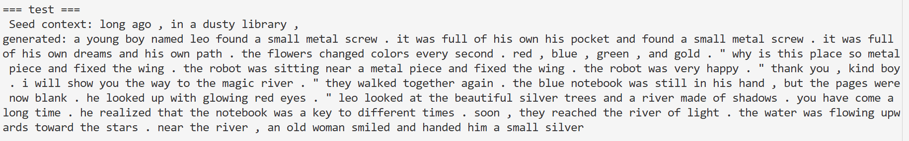
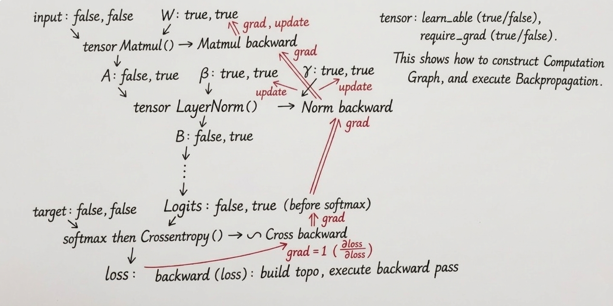

# C-autograd: A Lightweight Autograd Engine & Transformer in Pure C

## 📌 项目简介

本项目是一个完全从零开始构建的轻量级深度学习框架。不依赖任何第三方数学库（如 BLAS、Eigen）或深度学习后端，使用纯 C 实现了**静态计算图**与**反向传播引擎**。

为了验证引擎的可靠性，本项目在引擎之上构建了一个包含完整核心组件的 **Transformer (Decoder-only)** 模型，并实现了基于词表的自回归文本生成。

本项目旨在探索和展示深度学习框架的底层运行逻辑，适合用于深入理解自动微分机制与大语言模型（LLM）的底层架构。

## 🚀 核心特性

### 1. 静态计算图与自动微分 
* **静态构图**：先调用构图函数构建计算图，后续调用forward即可前向传播。
* **拓扑排序**：基于深度优先搜索实现计算图的拓扑排序，确保梯度按照正确的依赖顺序反向传播。
* **完整的生命周期管理**：设计了清晰的 Tensor 结构，包含数据、梯度、入度及计算节点指针，并实现了 `freeGraph` 进行图级别的内存释放，避免内存泄漏。

### 2. 丰富的算子支持与数值优化
实现了构建现代神经网络所需的核心算子，并均手工推导实现了反向传播逻辑（`backward_fn`）：
* **基础运算**：矩阵乘法 (`MatMul`)、矩阵加法 (`Add`)、矩阵转置 (`Transpose`)、标量乘法 (`MulConst`)。
* **激活函数**：`ReLU`、`Softmax`。
* **归一化**：`LayerNorm`（支持可学习的 `gamma` 和 `beta` 参数，手工推导其复杂的均值/方差求导链）。
* **数值稳定性优化**：
    * 在 `Softmax` 计算中引入了减去最大值的操作，防止指数溢出。
    * 实现了融合的 `SoftmaxThenCrossEntropy` 算子，提升计算效率并保障交叉熵求导的数值稳定性。
    * 张量初始化采用 **Xavier Initialization**，加速模型收敛。

### 3. Transformer 模型实现
在自定义引擎上搭建了 Transformer 架构，包含：
* **Word Embedding** 与 **Positional Encoding (正弦/余弦位置编码)**。
* **Masked Self-Attention**：实现了 $Q, K, V$ 投影与缩放点积注意力，并支持因果掩码（Causal Masking）。
* **前馈神经网络** 及 **残差连接**。
* **自回归生成**：内置带 Temperature 缩放的文本采样策略，实现基础的文本补全功能。

## 📁 文件结构

* `autograd.h` / `autograd.c`: 核心自动微分引擎，定义了 Tensor 数据结构、前向/反向传播逻辑、内存分配与回收。
* `tinytrans.c`: 使用构建的引擎搭建 Transformer 网络，包含训练循环与推理（生成）流程。
*  `xortest.c`: 用一个经典的异或测试，检查引擎能否实现非线性学习。
* `test.txt`: 模型训练所需的样本语料库（运行前需准备）。
## ⚙️ 一个简单的例子
以下代码展示了如何构建一个简单的线性回归层：


    // 1. 初始化输入、权重与偏置
    Tensor* x = createTensor(1, 10, false, false); // 输入数据
    Tensor* w = createTensor(10, 1, true, true);   // 权重（需要梯度，可学习）
    Tensor* b = createTensor(1, 1, true, true);    // 偏置

    // 2. 构建计算图 (y = xW + b)
    Tensor* mul = tensorMatMul(x, w);
    Tensor* pred = tensorAddBias(mul, b);

    // 3. 定义损失函数 (假设 target 为目标值)
    Tensor* loss = tensorSoftmaxThenCrossEntropy(pred, target);

    // 4. 训练
    forward(loss);
    backward(loss);
    update(loss, 0.01);
## ⚙️ 快速开始
### 一个简单的XOR测试
### 编译
    gcc -std=c99 -O3 xortest.c autograd.c -o xor_test -lm
### 执行
    ./xor_test
## 一个极简的tiny transformer
### 编译

    gcc -O3 -std=c99 autograd.c tinytrans.c -o tinytrans -lm
### 运行准备
在同级目录下创建一个 `test.txt` 文件(实际上项目中内置了一个模型表现良好的test.txt,可以直接使用)。

### 执行

```bash
./tinytrans
```
程序将输出模型的训练 Loss 变化，并在训练结束后，选取一段话作为 Seed，进行自回归的文本生成。
## 预期的测试结果
作者自己的测试结果如下：


## 🧠  Why this project?

  **本项目拒绝了现成库的便利，选择用纯 C 语言去触摸深度学习的灵魂。这不仅是对 LLM 底层逻辑的复现，更是一次回归计算机科学原点的探索——在‘手动管理’的汗水中，真正理解每一个权重背后的数学尊严。**


---

## 附录：算子与功能列表

本引擎提供了一系列基础矩阵运算、深度学习常用激活函数及损失函数，所有算子均支持自动求导。

### 1. 基础矩阵运算

| 算子函数                 | 说明                                       | 对应导数实现         |
| :----------------------- | :----------------------------------------- | :------------------- |
| `tensorAdd(a, b)`        | **矩阵加法**：计算 $C = A + B$。           | `add_backward`       |
| `tensorAddBias(a, bias)` | **偏置加法**：将偏置向量加到矩阵的每一行。 | `add_bias_backward`  |
| `tensorMatMul(a, b)`     | **矩阵乘法**：标准的矩阵乘积运算。         | `matmul_backward`    |
| `tensorTranspose(a)`     | **矩阵转置**：调换矩阵的行与列。           | `transpose_backward` |
| `tensorMulConst(a, b)`   | **标量乘法**：矩阵与常数张量相乘。         | `mul_const_backward` |

### 2. 神经网络常用算子 

| 算子函数                          | 说明                                               | 对应导数实现         |
| :-------------------------------- | :------------------------------------------------- | :------------------- |
| `tensorReLU(a)`                   | **ReLU 激活函数**：f(x) = max(0, x)。           | `relu_backward`      |
| `tensorSoftmax(x)`                | **Softmax 归一化**：将输入转化为概率分布。         | `softmax_backward`   |
| `tensorLayerNorm(x, gamma, beta)` | **层归一化**：包含可学习参数 $\gamma$ 和 $\beta$。 | `layernorm_backward` |

### 3. 损失函数 

| 算子函数                                        | 说明                                          |
| :---------------------------------------------- | :-------------------------------------------- |
| `tensorSoftmaxThenCrossEntropy(logits, target)` | **交叉熵损失**：集成了 Softmax 的交叉熵实现。 |

### 4. 张量创建与管理 


* **基础创建**：
    * `createTensor(rows, cols, require_grad, is_learnable)`：创建一个指定形状的张量。
    * `randomizeTensor(t)`：使用随机值初始化张量（通常用于参数初始化）。
    * `createConstTensor(rows, cols, connum)`：创建一个填充特定常数的张量。
* **NLP 特定预处理**：
    * `createOneHotTensor` / `changeOneHotTensor`：生成 One-hot 编码张量。
    * `createPositionalEncoding(seq_len, d_model)`：生成 Transformer 专用的位置编码。
    * `createMaskTensor` / `changeMaskTensor`：生成 causal/Padding Mask，用于处理变长序列。
* **生命周期管理**：
    * `freeTensor(t)`：释放单个张量内存。
    * `freeGraph(loss)`：递归释放整个计算图占用的资源。

### 5. 自动微分核心控制 

通过以下函数驱动计算图的运行：

* **`forward(loss)`**：从输入节点开始，按拓扑顺序执行所有算子的前向计算。
* **`backward(loss)`**：执行反向传播，自动计算并累加每个 `require_grad` 为真的张量梯度。
* **`update(loss, lr)`**：基于计算出的梯度，利用简单的梯度下降法更新可学习参数。
* **`build_topo` / `flush_visit`**：内部维护计算图的拓扑排序，确保计算顺序的正确性。

## 附录2 设计原理图：


>（Independently designed, drawn by ai）：